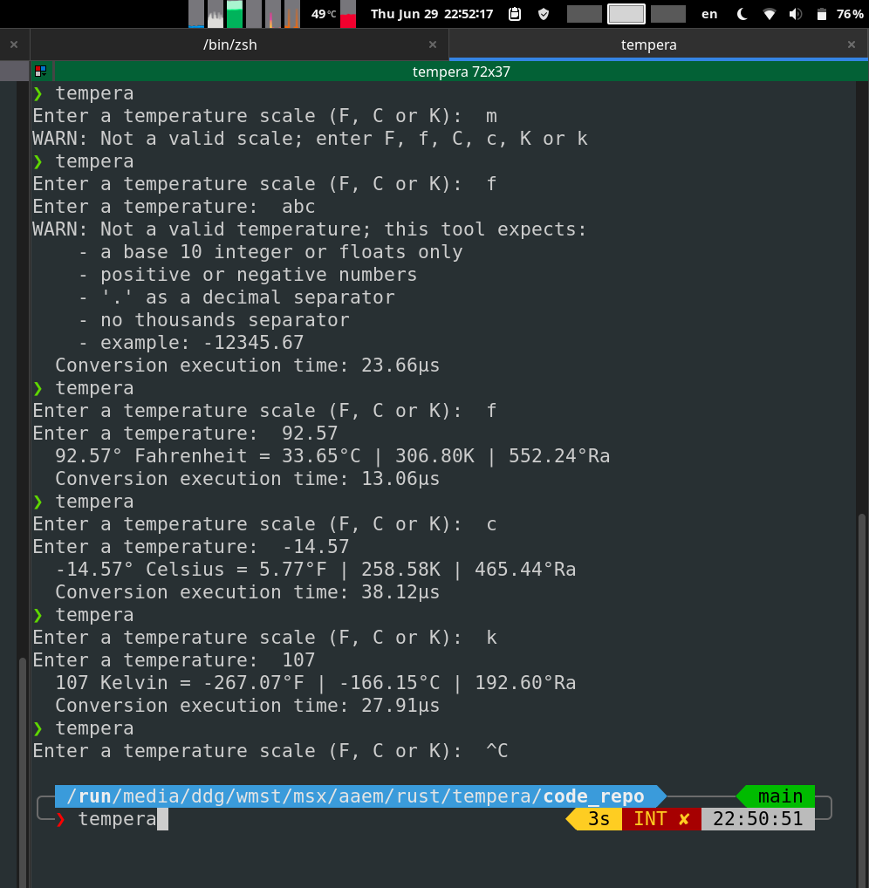

# Tempera
A very simple command-line temperature conversion tool written in Rust

## Screenshot
Click to enlarge

## Misc
Conversion formulas taken from [Wikipedia](https://en.wikipedia.org/wiki/Conversion_of_scales_of_temperature)
